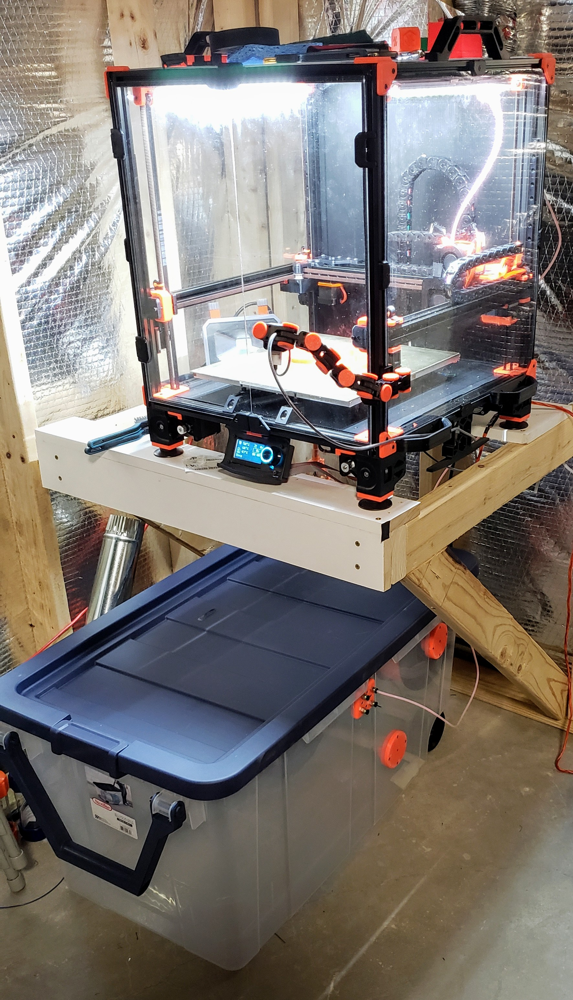

# Filament Storage and Reusable Spools

These are parts for reusable spools and a filament drybox.  The spools are remodeled versions of the ones found [here](https://www.villageplastics.com/the-filament-koil/).

For the drybox rods I have been cutting sections out of an 8' oak rod from Home Depot.  The box itself is a Sterilite 160 Qt. Wheeled Storage Box, also from Home Depot.

* 1 x Sterilite 160 Qt. Wheeled Storage Box: https://www.homedepot.com/p/309750700
* 1 x Everbuilt 8ft. Oak Closet Rod: https://www.homedepot.com/p/300722708
* 8 x PC4-M10 Male PTFE Quick Connectors: https://www.amazon.com/dp/B01KHN1HWY

The box can hold up to 30 1kg. spools on 5 rods.  1 upper/lower on each side and 1 lower in the center.  The PTFE passthrough allows for rapid changes of filament from 4 pre-fed spools to the outside (more if you add a 2nd PTFE passthrough).  The PTFE Passthrough has threaded spaces for 4 PC4-M10 (1.12mm thread pitch) connectors on each side.

 

