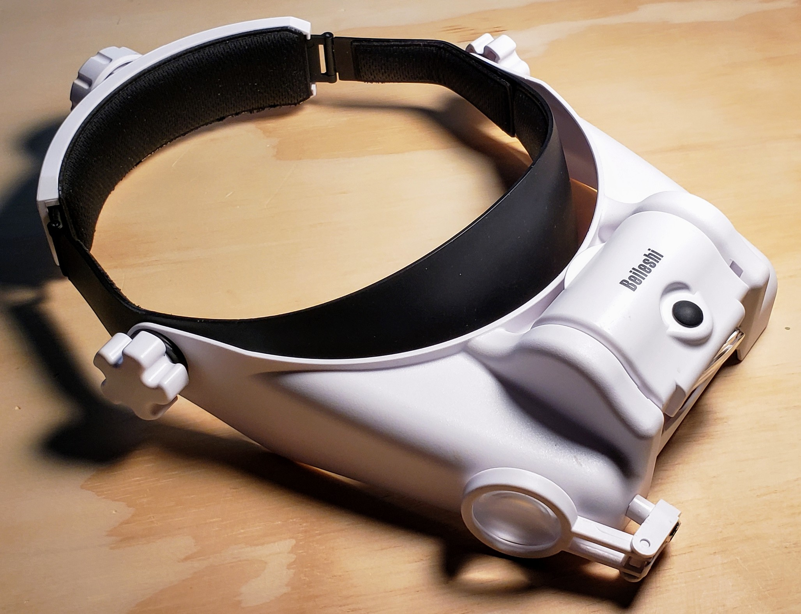
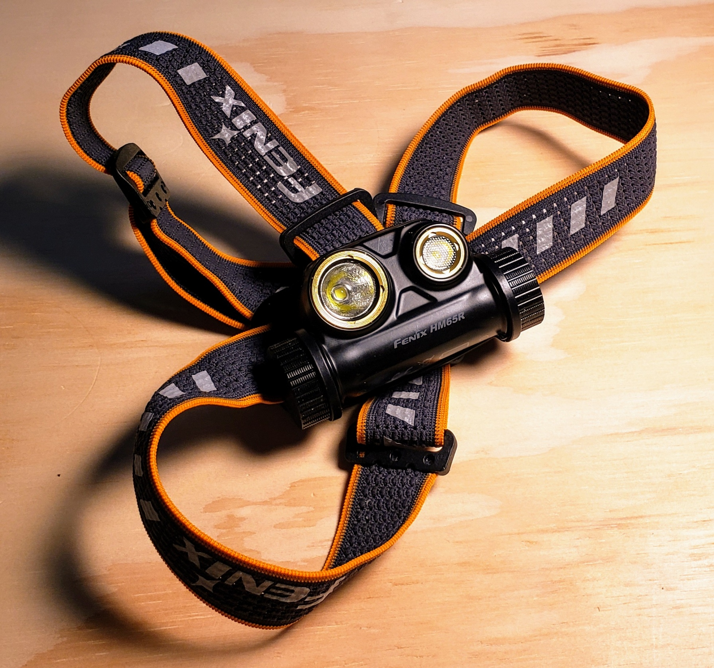

# Fenix HM65R Magnifier Modification
This project adds an external articulating magnification arm to the Fenix headlamp.  The Beileshi headband
magnifier, while a decent product, is very front heavy and burns through AA batteries like a California
wildfire.

The Beileshi was slightly pillaged for this mod.  The lens holder/slide adjuster was annexed for use here.

The magnifier mount has dual axis articulation at both the lamp and the lens arm to allow for it to keep the
lenses in front of your eyes while keeping it out of the direct path of the beam using the lens slider..

## Parts
* Fenix HM65R LED Headlamp:		https://www.amazon.com/dp/B07YSX2HQ7
* Beileshi Headband Magnifier:	https://www.amazon.com/dp/B07BF7Y7K3

